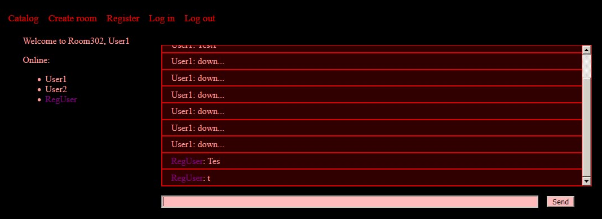

# node_chat



## Summary

Node chat, with rooms and optional registration.

## Usage

### Heroku deployment

Aside from node and git you'd need heroku account and cli. Also app requires an email to send confirm-registration messages and mongoDB connection. I used Atlas cloud to get free database, but you can also create one on heroku. Tables are really basic - users and rooms. Users have such fields as "username", "active" boolean, "role" string(which is currently not used anywhere) and "password". Rooms have "users" array, "info" string, "max_users" and "password". Chat messages aren"t stored anywhere, since it's supposed to be lightweight.

Clone this repository. Run these commands to log in and to initialize a new app:

```shell
heroku login
heroku create
```

Rename 'config_dummy.json' to 'config.json' and remove "config.json" from '.gitignore'. Copy the heroku host string from the previous step and paste it into config's "host" field. Enter your email address/password, database dsn. Open 'static/js/socket.js' file and add the host string there as well, like this: "io.connect(heroku_host)". That's pretty much it. You might also need to enable "allow less secure apps" option for your email, so your login attempts wouldn't get blocked. When you're all set, commit your changes and deploy:

```shell
git add -A
git commit -m "Initial commit"
git push heroku master
```

Now app should be running. To launch it locally install all packages with "npm install" and enter one of the following commands:

Just run it locally(port 5000):

```shell
heroku local web
```

Or with nodemon:

```shell
npm run-script devstart
```

## Notes

Everything seems to be working. The features are quite boring though(chat, really?), so there is definitely a room for improvement.